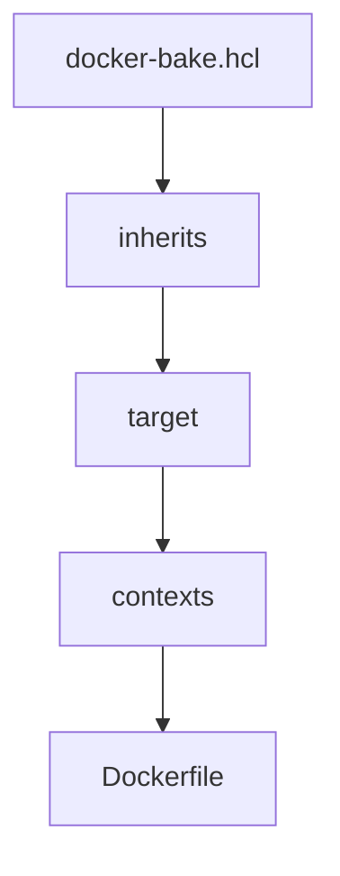

# DockerSphere Architecture

## Purpose

DockerSphere is a foundational Docker/OCI image factory designed to produce base images and reusable environments for the Vegito platform. It is not a business application but an infrastructure repository that provides essential Docker images for development, runtime, and various tooling stacks.

## Mental Model

The repository models a directed graph of components, capabilities, and distributions rather than a flat collection of independent Docker images. This graph is expressed declaratively using Docker Buildx Bake files, defining inheritance and context relationships between images.


## Build Graph as Source of Truth

The primary source of truth for the repository’s image graph is the set of `docker-bake.hcl` files scattered across the repository. These files define targets and groups, specifying:

- **inherits**: inheritance relationships between targets.
- **contexts**: named build contexts referencing other targets.
- **target references**: links between targets and Dockerfiles or other build definitions.

This layered referencing model enables composability and reuse of image components.



## Conceptual Layers

- **Components**: Atomic image pieces such as language runtimes, tooling, or base OS layers.
- **Capabilities**: Compositions of components that add specific functionalities, e.g., Golang environment, AI tools, or dockerd runtime.
- **Bundles**: Assembled distributions combining multiple capabilities to serve particular use cases or developer workflows.

## Repository Layout

The repository structure is organized but not authoritative for the build graph. A typical layout includes:

```
/
├── alpine/
├── debian/
│   ├── golang/
│   ├── python/
│   ├── rust/
│   ├── docker/
│   ├── bundle/
│   │   ├── ai/
│   │   ├── desktop-x/
│   │   └── project/
├── docker.io/
├── .github/
│   └── workflows/
├── .vscode/
├── Makefile
├── docker-bake.hcl
```

## Developer Interface

The `Makefile` serves as a convenient façade over Docker Buildx Bake, exposing commands for building, pushing, and managing image groups. It simplifies interaction with the complex build graph defined in HCL files.

Common commands include:

- `make images`: local build without push.
- `make images-ci`: build and push in CI.
- `make images-pull` / `make images-push`: image management.
- `make check-buildx-bake-duplicates`: consistency checks.

## CI/CD Pipeline

The CI/CD process is orchestrated via GitHub Actions, integrating versioning, changelog generation, multi-environment builds, and release publication.


Builds run on self-hosted runners with Google Cloud Workload Identity, pushing images and uploading logs to cloud storage.

## Key Technologies

The repository leverages a range of technologies and versions, including but not limited to:

- Go
- Node.js
- Docker Engine and Buildx
- Docker Compose
- Terraform
- Kubernetes and kubectl
- Rust
- Python
- VSCode integrations
- AI tooling stacks

Version defaults are centrally defined in build configuration files.

## Reasoning Guidelines

When working with this repository, prioritize:

- Understanding the build graph defined by `docker-bake.hcl` files as the authoritative source.
- Maintaining naming consistency and coherence in targets and groups.
- Proposing minimal, well-justified modifications rather than broad refactoring.
- Preserving existing repository conventions and architectural principles to avoid introducing inconsistencies.

## Conclusion

DockerSphere is a sophisticated, modular image factory that enables flexible composition of foundational images for the Vegito platform. Its declarative build graph and structured CI/CD pipeline support robust, multi-architecture image production tailored for diverse development and runtime scenarios.